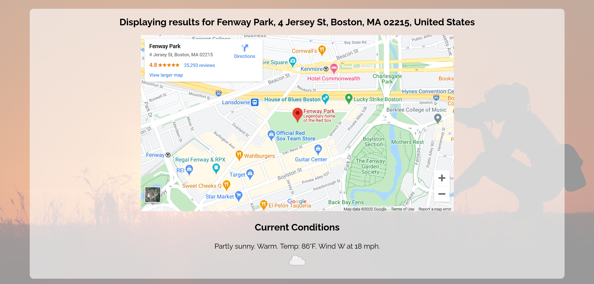
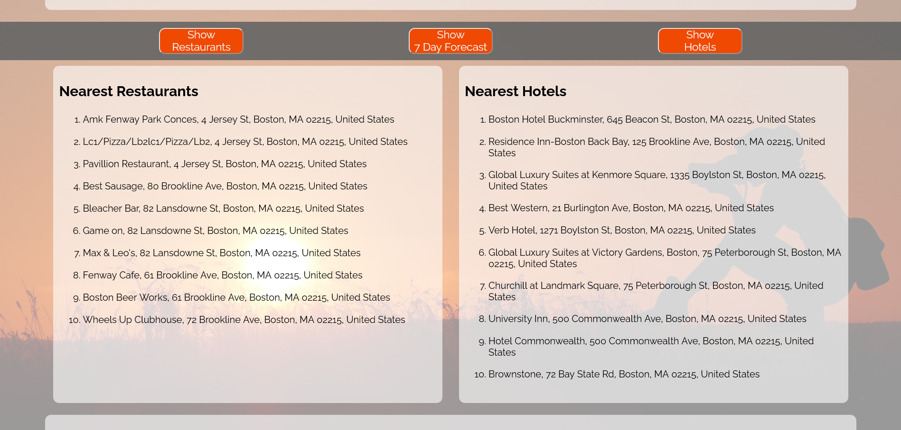
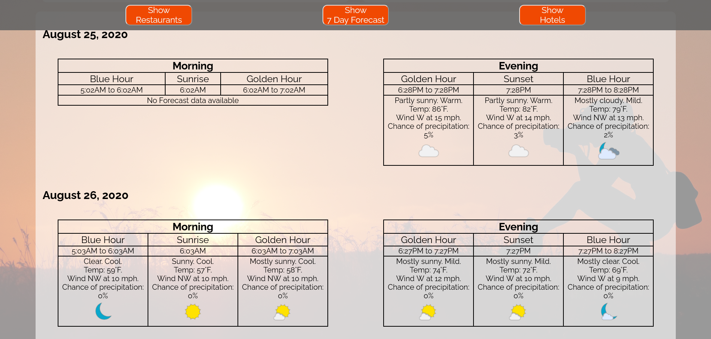

# Golden Outing

This app helps users to make plans around photographic Golden Hour and Blue Hour by providing times and weather forecasts for the next 7 days for any location, as well as information on the 10 nearest restaurants and hotels.

## Screenshots

Landing/Start Screen:

Map and current weather conditions for searched location:

Nearest restaurants and hotels:

Times and weather forecasts:

## How To Use It

Enter a location in the search box on the landing page.  A map, along with current conditions and Golden/Blue Hour times and weather for today will be displayed automatically.  Click the buttons to display the hotel and restaurant lists and the rest of the 7 day forecast.  The hotel and restaurant listings link to Google Maps.  To search a new location just enter it in the box!  It will be at the top of the page.

## Technologies Used

- HTML
- CSS
- Javascript
- jQuery

## Try It!

[Live App](https://matt-ros.github.io/golden-outing/)

## Acknowledgements

Thanks to Melissa Dallon, Trin and Dave Doherty, Dave Fox, and Daniel Rosensweig for testing and providing their feedback.
Special thanks to Melissa for the idea and for all her love and support.
